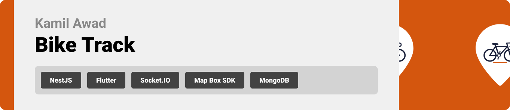
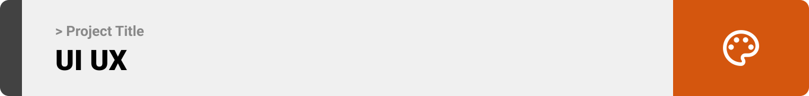
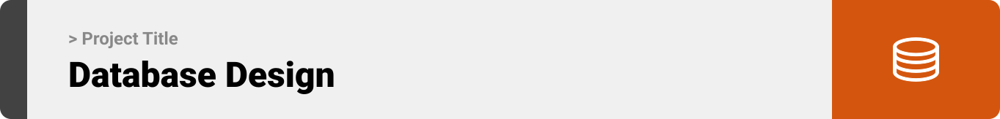
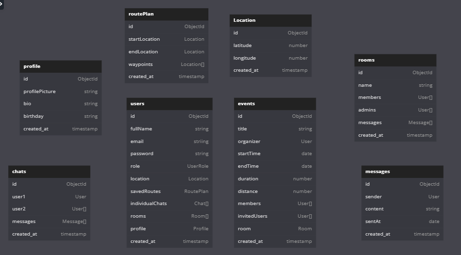
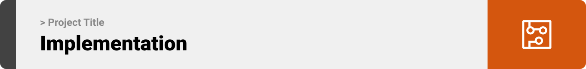
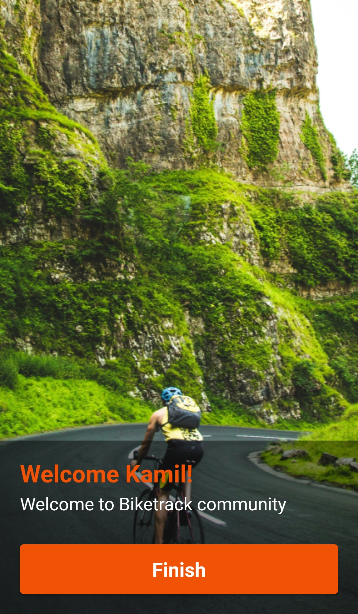

<br><br>

<!-- project philosophy -->


> A mobile app for tracking and planning bike routes and events, making it more enjoyale and easier for bike riders enthusiasts to engage in their favorite activity.
>
> Bike Track aims to bring bike riders together by providing a user-friendly platform where bike drivers can find new places with our route feature and makes every ride fun and social. We believe in enhancing the cycling experience by providing real-time tracking, efficient route planning, and fostering a community of cyclists.

### User Stories

### User

- As a user, I want to plan routes for my rides, so I can discover new biking trails and explore different areas.
- As a user, I want to join collaborative events, so I can participate in group rides and meet other cycling.
- As a user, I want to use the chat feature, so I can communicate with other users and share my experiences.

### Organizer

- As an organizer, I want to create events on the app, so I can invite users to participate.
- As an organizer, I want to create room chats, so I can communicate with the event memebers.
- As an organizer, I want to manage chat rooms for my events, so I can ensure a well organized event.

<br><br>
<!-- Tech stack -->


###  Bike Track is built using the following technologies:

- This project uses the [Flutter app development framework](https://flutter.dev/). Flutter is a cross-platform hybrid app development platform which allows us to use a single codebase for apps on mobile, desktop, and the web.
- This project uses Provider for state management. Provider is a popular solution in the Flutter ecosystem. By using Provider, you can efficiently manage app-wide state, making data flow predictable and organized.
- The backend of Bike Track is developed using the [NestJS framework](https://docs.nestjs.com/). NestJS, built on top of Express.js, provides a structured and scalable architecture for APIs.
- To power live features like chat, and real-time tracking, Bike Track integrates [Socket.IO](https://socket.io/). Socket.IO enables seamless communication between clients and servers.
- Our app integrates the [Google Maps SDK](https://developers.google.com/maps/documentation), users can explore biking trails, discover new areas, and plan their rides effectively using detailed maps.

<br><br>
<!-- UI UX -->



> We designed Bike Track using wireframes and mockups, iterating on the design until we reached the ideal layout for easy navigation and a seamless user experience.

- Project Figma design [figma](https://www.figma.com/design/7EXIgrAfR7oMNQCGds6CHq/Bike-Track?node-id=317-683&t=0OrgyyHj8OOd6srD-0)


### Mockups
| Onboarding screen  | Login Screen | Home Screen |
| ---| ---| ---|
|  |  |  |

<br><br>

<!-- Database Design -->


###  Architecting Data Excellence: Innovative Database Design Strategies:




<br><br>


<!-- Implementation -->



### User Screens (Mobile)
| Onboarding screens  | Register screen | Login screen | Loading screen |
| ---| ---| ---| ---|
|  |  |  |  |
| Home Screen  | Routes Screen | Chats Screen | PlanRoute Screen |
|  |  |  |  |
<br><br>

<!-- AWS Deployment -->


###  Efficient Deployment: Unleashing the Potential with AWS Integration:

- This project leverages AWS deployment strategies to seamlessly integrate and deploy the backend services. With a focus on scalability, reliability, and performance, we ensure that Bike Track deliver robust and responsive solutions for diverse use cases.


_A demo of a Postman request to the Bike-Track backend running on an AWS EC2 instance._

Below were the steps taken to deploy BikeTrack's backend to AWS, after connecting to the AWS EC2 instance through SSH.

- **Step 1**: Update Packages
  ```sh
  sudo apt update
  sudo apt upgrade -y
  ```
- **Step 2**: Install Git, Node.js, NestJs and npm
  ````sh
  sudo apt install git -y
  sudo apt install nodejs -y
  sudo apt install npm -y
  sudo npm install -g @nestjs/cli
  ````
- **Step 3**: Clone the Repository
  ```sh
  git clone https://github.com/kamilawad/Bike-Track.git
  ```
- **Step 4**: Install Dependencies

  ```sh
  npm install
  ```

- **Step 5**: Install MongoDB packages
  ```sh
  sudo apt-get install -y mongodb-org
  ```
- **Step 6**: Start MongoDB 
  ```sh
  sudo systemctl enable mongod

   sudo service mongod start
  ```
- **Step 7**: Create a .env file in the root directory and add the following:

```env
DB_URI = mongodb://localhost:27017/biketrackdb

```

- **Step 8**: Set Up Caddy for Reverse Proxy
- install Caddy

```sh
sudo apt install -y debian-keyring debian-archive-keyring apt-transport-https
curl -1sLf 'https://dl.cloudsmith.io/public/caddy/stable/gpg.key' | sudo apt-key add -
curl -1sLf 'https://dl.cloudsmith.io/public/caddy/stable/debian.deb.txt' | sudo tee /etc/apt/sources.list.d/caddy-stable.list
sudo apt update
sudo apt install caddy
```

- Configure Caddy:

```sh
sudo nano /etc/caddy/Caddyfile
```

- Add the following configuration:

```caddy
your-domain.com {
  reverse_proxy localhost:3000
}
```

- Reload Caddy:

```sh
sudo systemctl reload caddy
```

- **Step 9**: Start the NestJs Server

```sh
npm run start:prod
```

Now your Bike Track backend should be up and running on your AWS EC2 instance with NestJS, MongoDB, and Caddy for reverse proxy.


<br><br>

<!-- Unit Testing -->


###  Precision in Development: Harnessing the Power of Unit Testing:

- This project employs rigorous unit testing methodologies to ensure the reliability and accuracy of code components. By systematically evaluating individual units of the software, we guarantee a robust foundation, identifying and addressing potential issues early in the development process.

<br><br>


<!-- How to run -->


> To set up Bike Track locally, follow these steps:

### Prerequisites

First install npm and Nest CLI globally
* npm
  ```sh
  npm install npm@latest -g
  npm install -g @nestjs/cli
  ```

Install Flutter [SDK](https://docs.flutter.dev/get-started/install).

### Installation

1. Get a Google Map API Key at [google cloud console](https://console.cloud.google.com/)

2. Clone the repo
   git clone [github](https://github.com/kamilawad/Bike-Track)
   
3. Enter your API in `config.js`
   ```js
   const GOOGLE_MAP_API_KEY = 'ENTER YOUR API';
   ```
4. Install NPM packages
   ```sh
   cd server
   npm install
   ```
5. Run NestJs server
```sh
   npm run start:dev
   ```

Now, you should be able to run Bike Track locally and explore its features.
